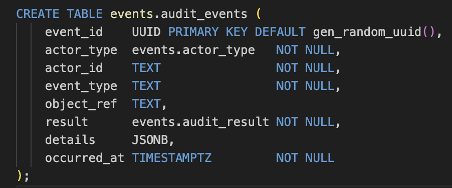

# Legal Aspects

This project addresses **the legal context** of handling **sensitive data** through a protection pipeline based on **AWS Macie** and **AWS KMS**. The analysis is not limited to the tools themselves but follows the **entire lifecycle of data** within an organization.
From **data modeling** to **access control** and **DPO oversight**, each stage is examined with regard to relevant compliance obligations and risks.

In this document, I aim to outline the **key legal aspect**, placing them in line with the **chronological development** of my project.

# I. Legal Aspect at the Database Modeling Stage

## 1.1. Use of Universally Unique Identifiers (UUIDs)

**UUID (Universally Unique Identifier)** is a 128-bit value designed to provide a unique reference for records in a database.
Unlike incremental IDs (1, 2, 3, …), UUIDs are not predictable and do not carry information about the sequence of data creation. This makes them technically useful for distributed systems and legally relevant **for privacy protection**.

### Why UUIDs in our database?

In our database design, UUIDs are used as **primary keys** for `employees` and related entities.  
This choice is not only technical but also supports legal compliance:

- **[GDPR Article 4(5) — Pseudonymisation](https://eur-lex.europa.eu/legal-content/EN/TXT/PDF/?uri=CELEX:32016R0679#page=33) (official PDF)**  
  UUIDs act as neutral identifiers. On their own, they reveal nothing about the individual.  
  Only when combined with a lookup table (e.g., `UUID` → `name`, `email`) can they be linked to a person.  
  This makes them effective for **pseudonymisation** at the schema level.  

- **[GDPR Article 25 — Data Protection by Design and by Default](https://eur-lex.europa.eu/legal-content/EN/TXT/PDF/?uri=CELEX:32016R0679#page=48) (official PDF)**  
Using UUIDs from the very beginning reduces identifiability by default, aligning with the principle of privacy by design.  

- **[BDSG §26 — Employee Data Processing](https://www.gesetze-im-internet.de/bdsg_2018/__26.html)**  
  German law limits processing to what is necessary for employment.  
  By separating **technical identifiers** (UUIDs) from **direct identifiers** (`name`, `email`, `IBAN`), data minimisation is achieved and risks of unnecessary exposure are reduced.

❗PENDING: db column pic (!)

## 1.2. Lawful Bases for Data Processing

In our company database, the **employees** table includes a dedicated column `lawful_basis`.
This field records the legal ground for processing employee data in accordance with **GDPR Article 6**.

### Purpose of this design

❗PENDING: db column pic (!)

- **Privacy by design ([GDPR Art. 25](https://eur-lex.europa.eu/legal-content/EN/TXT/PDF/?uri=CELEX:32016R0679#page=48)):** compliance is integrated already at the modeling stage, not added later.  
- **Traceability:** each employee record is linked to a specific lawful basis.  
- **Audit-readiness:** DPOs and auditors can easily verify that no personal data exists in the system without a valid justification.  

### Lawful bases considered ([GDPR Art. 6](https://eur-lex.europa.eu/legal-content/EN/TXT/PDF/?uri=CELEX:32016R0679#page=36))

- **Art. 6(1)(a) — `Consent`**  
  *Example:* employee consents to the publication of a photo on the company website.  
- **Art. 6(1)(b) — `Contract`**  
  *Example:* payroll and HR processing required by the employment contract.  
- **Art. 6(1)(c) — `Legal obligation`**  
  *Example:* tax and social security reporting mandated by law.  
- **Art. 6(1)(d) — `Vital interests`**  
  *Example:* sharing medical information in an emergency.  
- **Art. 6(1)(e) — `Public task`**  
  *Example:* processing required for public interest or official authority (mostly public sector).  
- **Art. 6(1)(f) — `Legitimate interests`**  
  *Example:* workplace security via CCTV, provided employee rights are not overridden.  

### Why it matters?

Embedding the lawful basis directly into the schema:  
- provides **transparency for the DPO**, who can immediately verify the legal ground for each dataset,
- ensures early compliance with **GDPR and BDSG requirements** by embedding them at the modeling stage, which in turn reduces **company costs** by avoiding later redesign.

## 1.3. Audit Events Logging

Our company have both a **need and a legal obligation** to record and monitor actions involving sensitive data.  

### Who is entitled to perform audits?

- **Data Protection Officer (DPO)**, as defined in [GDPR, Art. 37–39](https://eur-lex.europa.eu/legal-content/EN/TXT/PDF/?uri=CELEX:32016R0679#page=55).  
- Internal compliance or IT security teams, their results may be requested by supervisory authorities under [GDPR, Art. 58](https://eur-lex.europa.eu/legal-content/EN/TXT/PDF/?uri=CELEX:32016R0679#page=69).
- National authorities also act under [BDSG §40–41](https://www.gesetze-im-internet.de/bdsg_2018/__40.html), which regulate supervisory powers and cooperation duties.

Under the [GDPR, Art. 4(7)](https://eur-lex.europa.eu/legal-content/EN/TXT/PDF/?uri=CELEX:32016R0679&from=EN#page=33), the company is assigned the legal status of **Controller**, because it decides on the purposes and means of processing personal data. This status comes with clear legal duties:  
- to ensure that security measures are in place,  
- to be able to demonstrate compliance,  
- and to provide information to data subjects when required.  

The [GDPR, Art. 5(2) – Accountability](https://eur-lex.europa.eu/legal-content/EN/TXT/PDF/?uri=CELEX:32016R0679#page=36) states that the controller must be able to prove compliance with data protection principles. Without audit trails this is impossible. The [GDPR, Art. 32 – Security of processing](https://eur-lex.europa.eu/legal-content/EN/TXT/PDF/?uri=CELEX:32016R0679#page=52) also requires appropriate technical and organizational measures; logging audit events is one of the key safeguards.

To meet these requirements, we include the table `EVENTS.AUDIT_EVENTS` already at the stage of **data modeling**.  

This table records:  
- what happened (event type, object reference),  
- who was the actor (user, system, or service),  
- what was the result (for example: allowed, denied, role missing).

### Why it matters? 
  The [BDSG §9](https://www.gesetze-im-internet.de/bdsg_2018/__9.html) further confirms the need for access, transmission, and input controls, which audit logging provides.
  Logs can also serve as supporting evidence for the [GDPR, Art. 30 – Records of processing activities](https://eur-lex.europa.eu/legal-content/EN/TXT/PDF/?uri=CELEX:32016R0679#page=50), since they document how and when personal data is accessed.

###  /Storage limitation
Audit logs must respect the GDPR principle of **storage limitation** ([Art. 5(1)(e)](https://eur-lex.europa.eu/legal-content/EN/TXT/PDF/?uri=CELEX:32016R0679#page=35)).  
In practice, companies usually retain logs for **6–24 months**, depending on risk level and regulatory environment. After that, the data should be deleted or anonymized.

### /Notification
Audit events are also critical when handling security incidents.  
Under the [GDPR, Art. 33 – Notification of a personal data breach](https://eur-lex.europa.eu/legal-content/EN/TXT/PDF/?uri=CELEX:32016R0679#page=52), controllers must inform supervisory authorities within 72 hours. Audit logs make it possible to reconstruct what happened and when.

### /Data Subject Access Requests (DSARs)

Audit events are also critical for handling **Data Subject Access Requests (DSARs)**.  
According to the [GDPR, Art. 15 – Right of access](https://eur-lex.europa.eu/legal-content/EN/TXT/PDF/?uri=CELEX:32016R0679#page=43), individuals can request information about how their data has been processed. Audit logs make it possible to provide such proof.  

