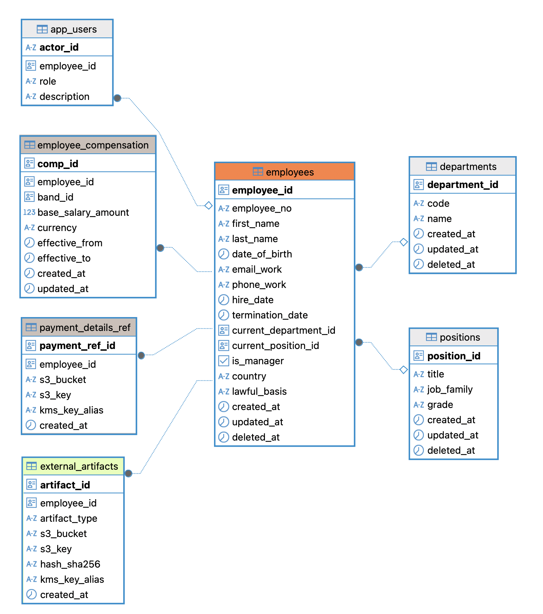

# Project Chronology

## Day 1 (September 4, 2025)
- Studied **AWS Macie** capabilities for sensitive data protection
- Reviewed how data isolation is implemented inside companies
- Analyzed company responsibilities for data storage and protection under **[GDPR](https://eur-lex.europa.eu/eli/reg/2016/679/oj)** and **[BDSG](https://www.gesetze-im-internet.de/bdsg_2018/)**
- Started drafting the [database schema](synth_data/db_preparation) in **db_preparation**
- Established the need for **UUIDs** and explicit **lawful basis** tracking at the modeling stage to 

## Day 2 (September 5, 2025)
- Ongoing refinement of [database schema](synth_data/db_preparation)
- Started [Legal Aspects](Legal_Aspects.md) — this document will serve as the main space for notes and clarifications on legal aspects throughout the project
- Added sections: [UUIDs (§1.1)](Legal_Aspects.md#11-use-of-universally-unique-identifiers-uuids), [Lawful Bases (§1.2)](Legal_Aspects.md#12-lawful-bases-for-data-processing)
- Linked GDPR/BDSG references

## Day 3 (September 8, 2025)
- Finished the [database schema](synth_data/db_preparation)
- Studied the legal aspects of audits – their role and implementation
- Added new section: [Audit Events Logging (§1.3)](Legal_Aspects.md#13-audit-events-logging)
- Created the SQL script [`create_db_postgres.sql`](db_scripts/create_db_postgres.sql) for database setup
- Database successfully created

## Day 4 (September 9, 2025)
- Finished the script for synthetic data generation and automatic database filling - [`synth_data_generation.py`](synth_data/synth_data_generation.py)
- Database filled with synthetic data
- Displayed the current ER diagram

## Day 5 (September 10, 2025)
- Finished SQL-scripts:
    - [`create_roles_setup.sql`](bd_scripts/create_roles_setup.sql) - Group roles are created here. They are not meant for direct login or database connections. Instead, users inherit their read, write, and administrative permissions through these groups.
    - [`login_users.sql`](bd_scripts/login_users.sql) - This part creates individual user roles with login and password credentials. Each user is linked to a group role, which defines their effective permissions.
    - [`company_pii_data_masking.sql`](db_scripts/company_pii_data_masking.sql) - Here we enforce data masking and row-level security for employee records. Only system and DPO roles have unrestricted access; all other roles view masked or filtered data.
    - [`finance_pii_data_masking.sql`](db_scripts/finance_pii_data_masking.sql) - Similar measures are applied to financial data.
    - [`events_access.sql`](db_scripts/events_access.sql) - Here we protect audit data: only specific roles can view it, and only the system can add new records.

## Day 6 (September 15, 2025)
- Added sections: 
    - [Data Masking for PII and Sensitive Attributes (§2.1)](Legal_Aspects.md#21-data-masking-for-pii-and-sensitive-attributes)
    - [Least Privilege and Role-Based Access Control (§2.2)](Legal_Aspects.md#22-least-privilege-and-role-based-access-control)

## Day 7 (September 16, 2025)
- Studied `AWS KMS` (symmetric vs asymmetric keys, customer-managed vs AWS-managed keys)
- Created an S3 bucket `gdpr-sensitive-bucket` for potential storage of sensitive data
- Prepared the [`data structure`](aws/s3_bucket_structure) for the S3 bucket (folders for HR, Finance, Medical, Audit) 
- Created IAM users and IAM roles for isolated access to the bucket
- Configured inline access policies for the IAM roles:
    - [`accountant_permissions.json`](aws/permissions/accountant_permissions.json)
    - [`analyst_permissions.json`](aws/permissions/analyst_permissions.json)
    - [`data_engineer_permissions.json`](aws/permissions/data_engineer_permissions.json)
    - [`dpo_permissions.json`](aws/permissions/dpo_permissions.json)
    - [`hr_permissions.json`](aws/permissions/hr_permissions.json)
    - [`medical_permissions.json`](aws/permissions/medical_permissions.json)
    